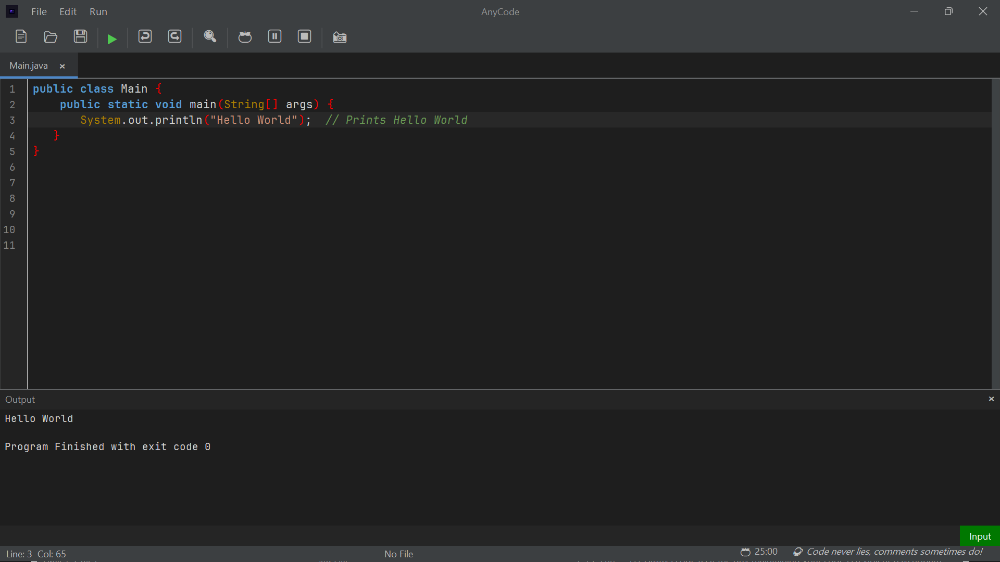
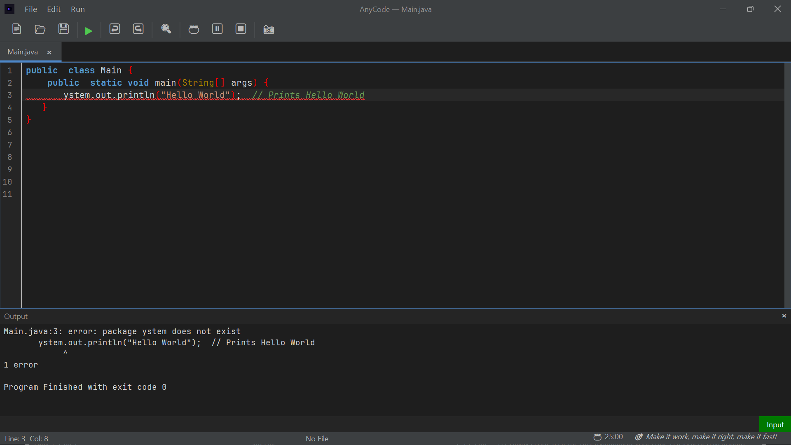
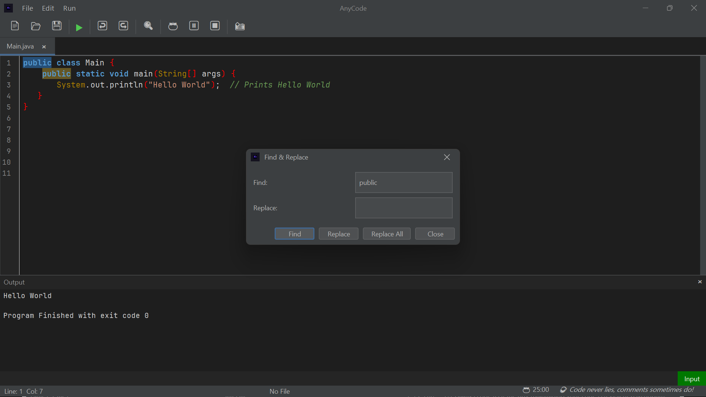
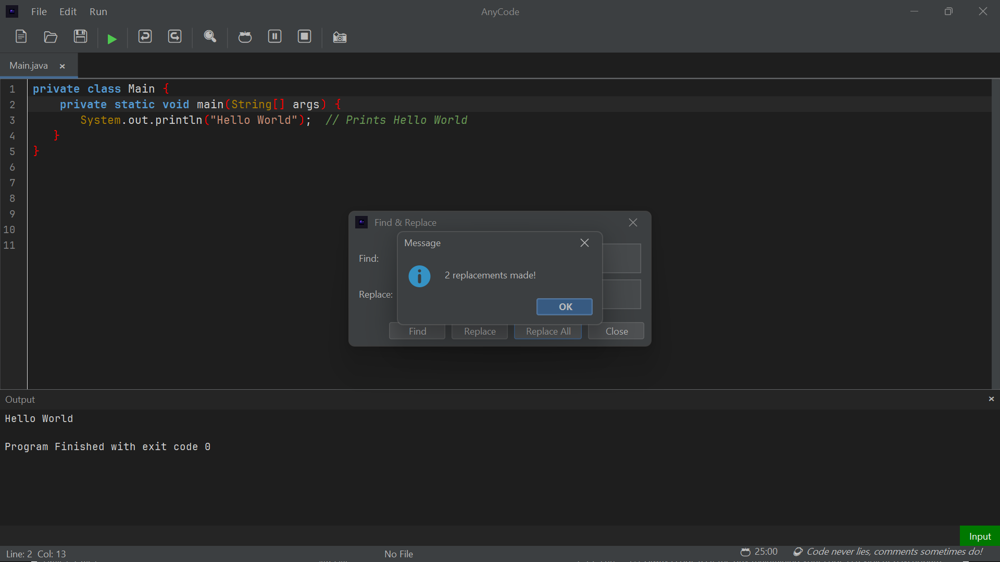
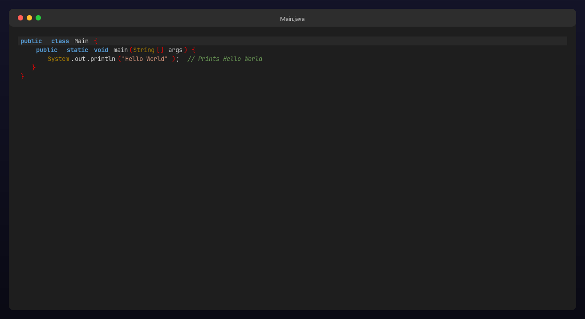

# AnyCode
AnyCode is a Java Swing-based code editor 

## Features
- Multiple editor tabs
- Syntax Highlighting
- File Management
- Code Execution
- Output Panel
- Find and Replace
- Focus Timer (Pomodoro-timer)
- Code Snapshot

## Technoligies Used
- Java
- Swing
- RSyntaxTextArea
- FlatLaf

## How to Run
- Clone the repository
- Open the project in IntelliJ IDEA
- Add the libraries from the lib Folder
- Run Main.java
  
## Author
S.M.Jaazib Anwaar

## Screenshots
### Main Window 

### Error Highlighting

### Find

### Replacements

### Code Snapshot

